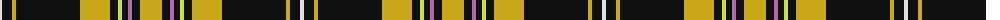

The parent of this is [Livingston Football Club](/tartans/ln/4/k10/y4/k64/y30/k8/lg4/k6/p4/k8/y/22/)

This was sourced from register-of-tartans.  It is a [11 stripes tartan](/stripes/stripes11/).

Original link https://www.tartanregister.gov.uk/tartanDetails.aspx?ref=2132

## Thread count
LN/4 K10 Y4 K64 Y30 K8 LG4 K6 P4 K8 Y/22

## Palette
Each colour and its ΔE from the base-6 reference it is a variant of.

| Colour | Shade | Base | ΔE (OKLab) |
|---|---|---|---|
| DY |  `#BC8C00` | Y  | 0.16 |
| K |  `#101010` | K  | 0.17 |
| LG |  `#C8E040` | Y  | 0.08 |
| LN |  `#E0E0E0` | W  | 0.06 |
| P |  `#B468AC` | R  | 0.21 |
| Y |  `#C8A818` | Y  | 0.08 |

ID: /variants/ln/4/k10/y4/k64/y30/k8/lg4/k6/p4/k8/y/22-dybc8c00-k101010-lgc8e040-lne0e0e0-pb468ac-yc8a818/
