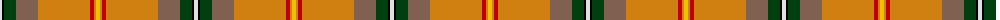

The parent of this is [Saskatchewan](/tartans/ln/4/k2/dg12/lt22/o52/r4/o2/y/4/)

This was sourced from weddslist.  It is a [8 stripes tartan](/stripes/stripes8/).

Original link http://www.weddslist.com/cgi-bin/tartans/pg.pl?source=sts

## Thread count
LN/4 K2 DG12 LT22 O52 R4 O2 Y/4

## Palette
Each colour and its ΔE from the base-6 reference it is a variant of.

| Colour | Shade | Base | ΔE (OKLab) |
|---|---|---|---|
| DG |  `#004010` | G  | 0.12 |
| K |  `#000000` | K  | 0.00 |
| LN |  `#E0E0E0` | W  | 0.06 |
| LT |  `#806050` | R  | 0.17 |
| O |  `#D08010` | Y  | 0.17 |
| R |  `#C00000` | R  | 0.02 |
| Y |  `#F0C000` | Y  | 0.01 |

# Sample pattern

ID: /variants/ln/4/k2/dg12/lt22/o52/r4/o2/y/4-dg004010-k000000-lne0e0e0-lt806050-od08010-rc00000-yf0c000/
