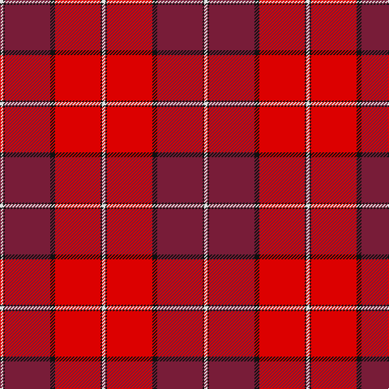

The parent of this is [Aberdeen Football Club (1990)](/tartans/ln/4/k2/dr56/k6/r56/k2/ln/4/)

This was sourced from register-of-tartans.  It is a [7 stripes tartan](/stripes/stripes7/).

Original link https://www.tartanregister.gov.uk/tartanDetails.aspx?ref=16

## Thread count
LN/4 K2 DR56 K6 R56 K2 LN/4

## Palette
Each colour and its ΔE from the base-6 reference it is a variant of.

| Colour | Shade | Base | ΔE (OKLab) |
|---|---|---|---|
| DR |  `#781C38` | R  | 0.17 |
| K |  `#101010` | K  | 0.17 |
| LN |  `#E0E0E0` | W  | 0.06 |
| R |  `#DC0000` | R  | 0.04 |

# Sample pattern

ID: /variants/ln/4/k2/dr56/k6/r56/k2/ln/4-dr781c38-k101010-lne0e0e0-rdc0000/
