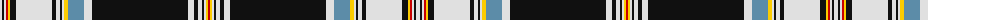

The parent of this is [Normandy Bay Myth (Fashion)](/tartans/ln/4/k2/ln2/r2/y2/k6/ln36/k4/ln4/k2/ln2/y4/b16/ln8/k96/ln6/k4/ln4/k2/ln2/y2/r/2/)

This was sourced from tartans-authority.  It is a [22 stripes tartan](/stripes/stripes22/).

Original link http://www.tartansauthority.com/tartan-ferret/display/10747/

## Thread count
LN/4 K2 LN2 R2 Y2 K6 LN36 K4 LN4 K2 LN2 Y4 B16 LN8 K96 LN6 K4 LN4 K2 LN2 Y2 R/2

## Palette
Each colour and its ΔE from the base-6 reference it is a variant of.

| Colour | Shade | Base | ΔE (OKLab) |
|---|---|---|---|
| B |  `#5C8CA8` | B  | 0.23 |
| K |  `#101010` | K  | 0.17 |
| LN |  `#E0E0E0` | W  | 0.06 |
| R |  `#C80000` | R  | 0.00 |
| Y |  `#FCCC00` | Y  | 0.04 |

ID: /variants/ln/4/k2/ln2/r2/y2/k6/ln36/k4/ln4/k2/ln2/y4/b16/ln8/k96/ln6/k4/ln4/k2/ln2/y2/r/2-b5c8ca8-k101010-lne0e0e0-rc80000-yfccc00/
