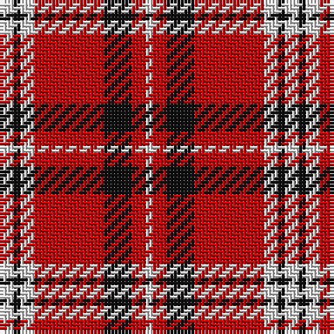

The parent of this is [Russell, Ralph T. (Personal)](/tartans/ln/4/k2/ln4/r20/k8/r4/ln/2/)

This was sourced from tartans-authority.  It is a [7 stripes tartan](/stripes/stripes7/).

Original link http://www.tartansauthority.com/tartan-ferret/display/7950/

## Thread count
LN/4 K2 LN4 R20 K8 R4 LN/2

## Palette
Each colour and its ΔE from the base-6 reference it is a variant of.

| Colour | Shade | Base | ΔE (OKLab) |
|---|---|---|---|
| K |  `#101010` | K  | 0.17 |
| LN |  `#E0E0E0` | W  | 0.06 |
| R |  `#C80000` | R  | 0.00 |

# Sample pattern

ID: /variants/ln/4/k2/ln4/r20/k8/r4/ln/2-k101010-lne0e0e0-rc80000/
