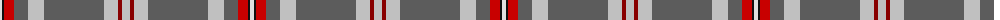

The parent of this is [Hebridean Fire](/tartans/ln/4/k2/r10/n14/na16/n60/na14/dr4/na/8/)

This was sourced from tartans-authority.  It is a [9 stripes tartan](/stripes/stripes9/).

Original link http://www.tartansauthority.com/tartan-ferret/display/8560/

## Thread count
LN/4 K2 R10 N14 Na16 N60 Na14 DR4 Na/8

## Palette
Each colour and its ΔE from the base-6 reference it is a variant of.

| Colour | Shade | Base | ΔE (OKLab) |
|---|---|---|---|
| DR |  `#880000` | R  | 0.14 |
| K |  `#101010` | K  | 0.17 |
| LN |  `#E0E0E0` | W  | 0.06 |
| N |  `#5C5C5C` | B  | 0.14 |
| Na |  `#C0C0C0` | W  | 0.16 |
| R |  `#C80000` | R  | 0.00 |

ID: /variants/ln/4/k2/r10/n14/na16/n60/na14/dr4/na/8-dr880000-k101010-lne0e0e0-n5c5c5c-nac0c0c0-rc80000/
