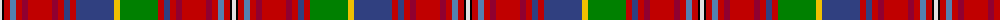

The parent of this is [Fitzgerald dress](/tartans/ln/4/k2/r6/ba6/r6/dr6/r24/dr6/r6/b6/r6/b38/y6/g38/r6/b6/r6/dr6/r24/dr6/r6/ba6/r6/k2/ln/4/)

This was sourced from weddslist.  It is a [25 stripes tartan](/stripes/stripes25/).

Original link http://www.weddslist.com/cgi-bin/tartans/pg.pl?source=sts

## Thread count
LN/4 K2 R6 Ba6 R6 DR6 R24 DR6 R6 B6 R6 B38 Y6 G38 R6 B6 R6 DR6 R24 DR6 R6 Ba6 R6 K2 LN/4

## Palette
Each colour and its ΔE from the base-6 reference it is a variant of.

| Colour | Shade | Base | ΔE (OKLab) |
|---|---|---|---|
| B |  `#304080` | B  | 0.01 |
| Ba |  `#5480B0` | B  | 0.20 |
| DR |  `#900030` | R  | 0.13 |
| G |  `#008000` | G  | 0.09 |
| K |  `#000000` | K  | 0.00 |
| LN |  `#E0E0E0` | W  | 0.06 |
| R |  `#C00000` | R  | 0.02 |
| Y |  `#F0C000` | Y  | 0.01 |

ID: /variants/ln/4/k2/r6/ba6/r6/dr6/r24/dr6/r6/b6/r6/b38/y6/g38/r6/b6/r6/dr6/r24/dr6/r6/ba6/r6/k2/ln/4-b304080-ba5480b0-dr900030-g008000-k000000-lne0e0e0-rc00000-yf0c000/
