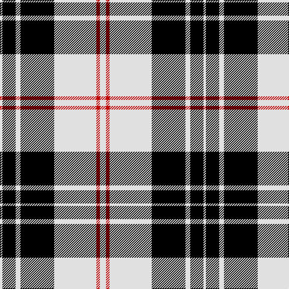

The parent of this is [MacPherson, of Cluny](/tartans/ln/4/k22/ln8/k56/ln70/r6/ln/10/)

This was sourced from weddslist.  It is a [7 stripes tartan](/stripes/stripes7/).

Original link http://www.weddslist.com/cgi-bin/tartans/pg.pl?source=sts

## Thread count
LN/4 K22 LN8 K56 LN70 R6 LN/10

## Palette
Each colour and its ΔE from the base-6 reference it is a variant of.

| Colour | Shade | Base | ΔE (OKLab) |
|---|---|---|---|
| K |  `#000000` | K  | 0.00 |
| LN |  `#E0E0E0` | W  | 0.06 |
| R |  `#C00000` | R  | 0.02 |

# Sample pattern

ID: /variants/ln/4/k22/ln8/k56/ln70/r6/ln/10-k000000-lne0e0e0-rc00000/
