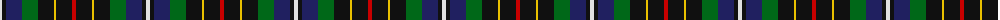

The parent of this is [Hislop Family Tartan Tartan Number: 2135. Earliest known date: 1992 Based on the Brodie tartan which Mr Hislop, who commissioned the design, remembered being worn by his grandfather. Other elements in the sett come from the tartans of the families in the district around Hawick which is associated with the Hislop name. The Hyslop spelling is known further west in Galloway and SW Scotland. See products available Copyright © Blair Urquhart, Comrie, 2015](/tartans/ln/4/k4/db16/g16/k16/y2/k16/r/4/)

This was sourced from house-of-tartan.  It is a [8 stripes tartan](/stripes/stripes8/).

Original link http://www.house-of-tartan.scotland.net/house/TartanViewjs.asp?colr=Def&tnam=2135

## Thread count
LN/4 K4 DB16 G16 K16 Y2 K16 R/4

## Palette
Each colour and its ΔE from the base-6 reference it is a variant of.

| Colour | Shade | Base | ΔE (OKLab) |
|---|---|---|---|
| DB |  `#202060` | B  | 0.11 |
| G |  `#006818` | G  | 0.02 |
| K |  `#101010` | K  | 0.17 |
| LN |  `#E0E0E0` | W  | 0.06 |
| R |  `#C80000` | R  | 0.00 |
| Y |  `#E8C000` | Y  | 0.00 |

# Sample pattern

ID: /variants/ln/4/k4/db16/g16/k16/y2/k16/r/4-db202060-g006818-k101010-lne0e0e0-rc80000-ye8c000/
