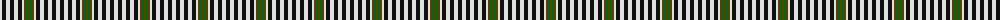

The parent of this is [Burns Check Trade Tartan Tartan Number: 1736. Earliest known date: 1959 Number of black stripes is not fixed. See products available Copyright © Blair Urquhart, Comrie, 2015](/tartans/ln/4/k4/ln4/k4/ln4/k4/ln2/t2/g2/t/2/)

This was sourced from house-of-tartan.  It is a [10 stripes tartan](/stripes/stripes10/).

Original link http://www.house-of-tartan.scotland.net/house/TartanViewjs.asp?colr=Def&tnam=1736

## Thread count
LN/4 K4 LN4 K4 LN4 K4 LN2 T2 G2 T/2

## Palette
Each colour and its ΔE from the base-6 reference it is a variant of.

| Colour | Shade | Base | ΔE (OKLab) |
|---|---|---|---|
| G |  `#006818` | G  | 0.02 |
| K |  `#101010` | K  | 0.17 |
| LN |  `#E0E0E0` | W  | 0.06 |
| T |  `#604000` | G  | 0.14 |

ID: /variants/ln/4/k4/ln4/k4/ln4/k4/ln2/t2/g2/t/2-g006818-k101010-lne0e0e0-t604000/
