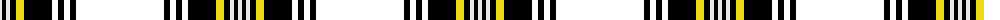

The parent of this is [Kang Personal Tartan Tartan Number: 7425. Earliest known date: 2007 Designed by Catriona Duffy and David Kang See products available Copyright © Blair Urquhart, Comrie, 2015](/tartans/ln/4/k4/ln4/k6/yc8/k28/rb6/k6/rb6/k6/rb/88/)

This was sourced from house-of-tartan.  It is a [11 stripes tartan](/stripes/stripes11/).

Original link http://www.house-of-tartan.scotland.net/house/TartanViewjs.asp?colr=Def&tnam=7425

## Thread count
LN/4 K4 LN4 K6 Yc8 K28 RB6 K6 RB6 K6 RB/88

## Palette
Each colour and its ΔE from the base-6 reference it is a variant of.

| Colour | Shade | Base | ΔE (OKLab) |
|---|---|---|---|
| DB |  `#200C60` | B  | 0.14 |
| K |  `#000000` | K  | 0.00 |
| LN |  `#E8E8E8` | W  | 0.04 |
| Y |  `#F0C400` | Y  | 0.02 |
| Ya |  `#F4BC3C` | Y  | 0.03 |
| Yb |  `#D8F000` | Y  | 0.12 |
| Yc |  `#E8DC14` | Y  | 0.07 |

ID: /variants/ln/4/k4/ln4/k6/yc8/k28/rb6/k6/rb6/k6/rb/88-db200c60-k000000-lne8e8e8-yf0c400-yaf4bc3c-ybd8f000-yce8dc14/
