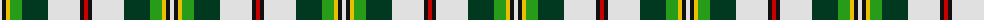
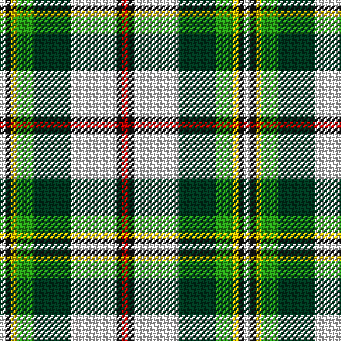

The parent of this is [Madewell Dress (Name)](/tartans/ln/4/k4/y4/g12/dg26/ln32/k4/r/4/)

This was sourced from tartans-authority.  It is a [8 stripes tartan](/stripes/stripes8/).

Original link http://www.tartansauthority.com/tartan-ferret/display/4051/

## Thread count
LN/4 K4 Y4 G12 DG26 LN32 K4 R/4

## Palette
Each colour and its ΔE from the base-6 reference it is a variant of.

| Colour | Shade | Base | ΔE (OKLab) |
|---|---|---|---|
| DG |  `#003820` | G  | 0.16 |
| G |  `#289C18` | G  | 0.18 |
| K |  `#101010` | K  | 0.17 |
| LN |  `#E0E0E0` | W  | 0.06 |
| R |  `#C80000` | R  | 0.00 |
| Y |  `#E8C000` | Y  | 0.00 |

# Sample pattern

ID: /variants/ln/4/k4/y4/g12/dg26/ln32/k4/r/4-dg003820-g289c18-k101010-lne0e0e0-rc80000-ye8c000/
