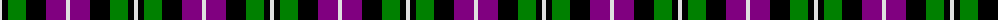

The parent of this is [MacNeil 2](/tartans/ln/4/k6/g18/k20/p20/ln/4/)

This was sourced from weddslist.  It is a [6 stripes tartan](/stripes/stripes6/).

Original link http://www.weddslist.com/cgi-bin/tartans/pg.pl?source=sts

## Thread count
LN/4 K6 G18 K20 P20 LN/4

## Palette
Each colour and its ΔE from the base-6 reference it is a variant of.

| Colour | Shade | Base | ΔE (OKLab) |
|---|---|---|---|
| G |  `#008000` | G  | 0.09 |
| K |  `#000000` | K  | 0.00 |
| LN |  `#E0E0E0` | W  | 0.06 |
| P |  `#800080` | B  | 0.17 |

# Sample pattern

ID: /variants/ln/4/k6/g18/k20/p20/ln/4-g008000-k000000-lne0e0e0-p800080/
