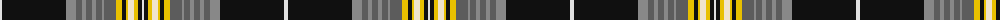

The parent of this is [Cornish Pascoe (Name)](/tartans/ln/4/k64/na10/n6/na4/n6/na4/n6/na2/n12/y6/k4/y2/w6/y4/k4/ln/2/)

This was sourced from tartans-authority.  It is a [17 stripes tartan](/stripes/stripes17/).

Original link http://www.tartansauthority.com/tartan-ferret/display/10189/

## Thread count
LN/4 K64 Na10 N6 Na4 N6 Na4 N6 Na2 N12 Y6 K4 Y2 W6 Y4 K4 LN/2

## Palette
Each colour and its ΔE from the base-6 reference it is a variant of.

| Colour | Shade | Base | ΔE (OKLab) |
|---|---|---|---|
| K |  `#101010` | K  | 0.17 |
| LN |  `#E0E0E0` | W  | 0.06 |
| N |  `#5C5C5C` | B  | 0.14 |
| Na |  `#888888` | R  | 0.24 |
| W |  `#F0E4CC` | W  | 0.05 |
| Y |  `#E8C000` | Y  | 0.00 |

ID: /variants/ln/4/k64/na10/n6/na4/n6/na4/n6/na2/n12/y6/k4/y2/w6/y4/k4/ln/2-k101010-lne0e0e0-n5c5c5c-na888888-wf0e4cc-ye8c000/
