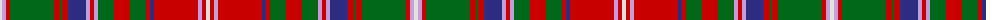

The parent of this is [MacDougall Clan Tartan Tartan Number: 1776. Earliest known date: 1977 Matched to a sample by B Urquhart in 2004, from Lochcarron reiver cloth. The purple colour was lightened considerably to a pale mauve, giving an almost equal prominence to the white. See products available Copyright © Blair Urquhart, Comrie, 2015](/tartans/ln/4/lp4/r4/g44/r6/g2/r6/db18/lp4/r4/lp4/g16/r16/g16/r4/db4/r44/lp4/r4/ln/4/)

This was sourced from house-of-tartan.  It is a [20 stripes tartan](/stripes/stripes20/).

Original link http://www.house-of-tartan.scotland.net/house/TartanViewjs.asp?colr=Def&tnam=1776

## Thread count
LN/4 LP4 R4 G44 R6 G2 R6 DB18 LP4 R4 LP4 G16 R16 G16 R4 DB4 R44 LP4 R4 LN/4

## Palette
Each colour and its ΔE from the base-6 reference it is a variant of.

| Colour | Shade | Base | ΔE (OKLab) |
|---|---|---|---|
| DB |  `#2C2C80` | B  | 0.05 |
| G |  `#006818` | G  | 0.02 |
| LN |  `#E0E0E0` | W  | 0.06 |
| LP |  `#C49CD8` | W  | 0.24 |
| N |  `#C484A4` | R  | 0.23 |
| R |  `#C80000` | R  | 0.00 |

ID: /variants/ln/4/lp4/r4/g44/r6/g2/r6/db18/lp4/r4/lp4/g16/r16/g16/r4/db4/r44/lp4/r4/ln/4-db2c2c80-g006818-lne0e0e0-lpc49cd8-nc484a4-rc80000/
