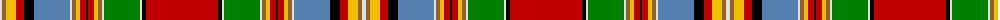

The parent of this is [Chattan](/tartans/ln/4/lt4/y10/r8/k10/b36/ln2/lt4/y4/r6/k2/r6/y4/lt4/ln2/g36/ln2/k4/r/72/)

This was sourced from weddslist.  It is a [19 stripes tartan](/stripes/stripes19/).

Original link http://www.weddslist.com/cgi-bin/tartans/pg.pl?source=sts

## Thread count
LN/4 LT4 Y10 R8 K10 B36 LN2 LT4 Y4 R6 K2 R6 Y4 LT4 LN2 G36 LN2 K4 R/72

## Palette
Each colour and its ΔE from the base-6 reference it is a variant of.

| Colour | Shade | Base | ΔE (OKLab) |
|---|---|---|---|
| B |  `#5480B0` | B  | 0.20 |
| G |  `#008000` | G  | 0.09 |
| K |  `#000000` | K  | 0.00 |
| LN |  `#E0E0E0` | W  | 0.06 |
| LT |  `#906030` | R  | 0.15 |
| R |  `#C00000` | R  | 0.02 |
| Y |  `#F0C000` | Y  | 0.01 |

ID: /variants/ln/4/lt4/y10/r8/k10/b36/ln2/lt4/y4/r6/k2/r6/y4/lt4/ln2/g36/ln2/k4/r/72-b5480b0-g008000-k000000-lne0e0e0-lt906030-rc00000-yf0c000/
