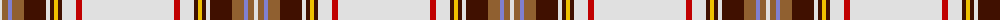

The parent of this is [Diana, Plaid dress](/tartans/ln/4/lt6/b4/lt12/dr22/ln4/dr4/y4/dr4/ln14/r6/ln/92/)

This was sourced from weddslist.  It is a [12 stripes tartan](/stripes/stripes12/).

Original link http://www.weddslist.com/cgi-bin/tartans/pg.pl?source=sts

## Thread count
LN/4 LT6 B4 LT12 DR22 LN4 DR4 Y4 DR4 LN14 R6 LN/92

## Palette
Each colour and its ΔE from the base-6 reference it is a variant of.

| Colour | Shade | Base | ΔE (OKLab) |
|---|---|---|---|
| B |  `#8080D0` | B  | 0.24 |
| DR |  `#401000` | B  | 0.23 |
| LN |  `#E0E0E0` | W  | 0.06 |
| LT |  `#906030` | R  | 0.15 |
| R |  `#C00000` | R  | 0.02 |
| Y |  `#F0C000` | Y  | 0.01 |

ID: /variants/ln/4/lt6/b4/lt12/dr22/ln4/dr4/y4/dr4/ln14/r6/ln/92-b8080d0-dr401000-lne0e0e0-lt906030-rc00000-yf0c000/
