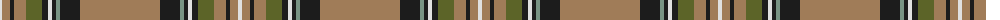

The parent of this is [Cavalier, Brown (Fashion)](/tartans/ln/4/lt8/k4/lt12/g16/k6/ln4/k4/lg4/k20/lt/80/)

This was sourced from tartans-authority.  It is a [11 stripes tartan](/stripes/stripes11/).

Original link http://www.tartansauthority.com/tartan-ferret/display/4482/

## Thread count
LN/4 LT8 K4 LT12 G16 K6 LN4 K4 LG4 K20 LT/80

## Palette
Each colour and its ΔE from the base-6 reference it is a variant of.

| Colour | Shade | Base | ΔE (OKLab) |
|---|---|---|---|
| G |  `#5C6428` | G  | 0.09 |
| K |  `#1C1C1C` | B  | 0.20 |
| LG |  `#789484` | G  | 0.23 |
| LN |  `#E0E0E0` | W  | 0.06 |
| LT |  `#A07C58` | R  | 0.19 |

ID: /variants/ln/4/lt8/k4/lt12/g16/k6/ln4/k4/lg4/k20/lt/80-g5c6428-k1c1c1c-lg789484-lne0e0e0-lta07c58/
