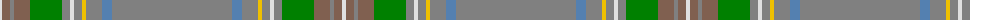

The parent of this is [Stuart / Stewart, Silver](/tartans/ln/4/lt8/n4/lt16/g32/n8/ln4/n8/y4/n16/b10/n/120/)

This was sourced from weddslist.  It is a [12 stripes tartan](/stripes/stripes12/).

Original link http://www.weddslist.com/cgi-bin/tartans/pg.pl?source=sts

## Thread count
LN/4 LT8 N4 LT16 G32 N8 LN4 N8 Y4 N16 B10 N/120

## Palette
Each colour and its ΔE from the base-6 reference it is a variant of.

| Colour | Shade | Base | ΔE (OKLab) |
|---|---|---|---|
| B |  `#5480B0` | B  | 0.20 |
| G |  `#008000` | G  | 0.09 |
| LN |  `#E0E0E0` | W  | 0.06 |
| LT |  `#806050` | R  | 0.17 |
| N |  `#808080` | G  | 0.22 |
| Y |  `#F0C000` | Y  | 0.01 |

ID: /variants/ln/4/lt8/n4/lt16/g32/n8/ln4/n8/y4/n16/b10/n/120-b5480b0-g008000-lne0e0e0-lt806050-n808080-yf0c000/
