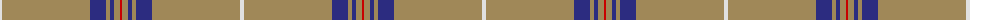

The parent of this is [Reece (Name)](/tartans/ln/4/lt88/db16/lt4/db4/lt6/r/2/)

This was sourced from tartans-authority.  It is a [7 stripes tartan](/stripes/stripes7/).

Original link http://www.tartansauthority.com/tartan-ferret/display/10327/

## Thread count
LN/4 LT88 DB16 LT4 DB4 LT6 R/2

## Palette
Each colour and its ΔE from the base-6 reference it is a variant of.

| Colour | Shade | Base | ΔE (OKLab) |
|---|---|---|---|
| DB |  `#2C2C80` | B  | 0.05 |
| LN |  `#E0E0E0` | W  | 0.06 |
| LT |  `#A08858` | Y  | 0.21 |
| R |  `#C80000` | R  | 0.00 |

# Sample pattern

ID: /variants/ln/4/lt88/db16/lt4/db4/lt6/r/2-db2c2c80-lne0e0e0-lta08858-rc80000/
