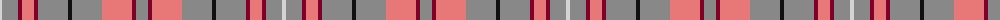

The parent of this is [Frater (Name)](/tartans/ln/4/n16/dr4/lr12/dr4/n30/k4/n30/lr30/dr4/n/12/)

This was sourced from tartans-authority.  It is a [11 stripes tartan](/stripes/stripes11/).

Original link http://www.tartansauthority.com/tartan-ferret/display/6810/

## Thread count
LN/4 N16 DR4 LR12 DR4 N30 K4 N30 LR30 DR4 N/12

## Palette
Each colour and its ΔE from the base-6 reference it is a variant of.

| Colour | Shade | Base | ΔE (OKLab) |
|---|---|---|---|
| DR |  `#800028` | R  | 0.16 |
| K |  `#101010` | K  | 0.17 |
| LN |  `#D4D4D4` | W  | 0.10 |
| LR |  `#E87878` | R  | 0.19 |
| N |  `#888888` | R  | 0.24 |

ID: /variants/ln/4/n16/dr4/lr12/dr4/n30/k4/n30/lr30/dr4/n/12-dr800028-k101010-lnd4d4d4-lre87878-n888888/
