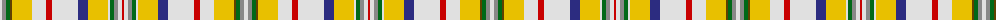

The parent of this is [Contrecoeur Dress (District)](/tartans/ln/4/n4/g4/t2/y20/ln14/r6/ln26/db10/y20/ln2/g4/n4/ln4/r/2/)

This was sourced from tartans-authority.  It is a [15 stripes tartan](/stripes/stripes15/).

Original link http://www.tartansauthority.com/tartan-ferret/display/2295/

## Thread count
LN/4 N4 G4 T2 Y20 LN14 R6 LN26 DB10 Y20 LN2 G4 N4 LN4 R/2

## Palette
Each colour and its ΔE from the base-6 reference it is a variant of.

| Colour | Shade | Base | ΔE (OKLab) |
|---|---|---|---|
| DB |  `#2C2C80` | B  | 0.05 |
| G |  `#006818` | G  | 0.02 |
| LN |  `#E0E0E0` | W  | 0.06 |
| N |  `#888888` | R  | 0.24 |
| R |  `#C80000` | R  | 0.00 |
| T |  `#604000` | G  | 0.14 |
| Y |  `#E8C000` | Y  | 0.00 |

ID: /variants/ln/4/n4/g4/t2/y20/ln14/r6/ln26/db10/y20/ln2/g4/n4/ln4/r/2-db2c2c80-g006818-lne0e0e0-n888888-rc80000-t604000-ye8c000/
