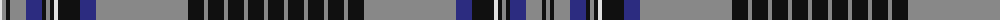

The parent of this is [Hood](/tartans/ln/4/n4/k4/n16/db16/k4/n4/k4/ln4/k22/db16/n92/k16/n4/k16/n4/k16/n4/k16/n4/k16/n4/k16/n4/k16/n4/k16/n4/k16/n92/db16/k22/ln4/k4/n4/k4/db16/n16/k4/n/4/)

This was sourced from register-of-tartans.  It is a [40 stripes tartan](/stripes/stripes40/).

Original link https://www.tartanregister.gov.uk/tartanDetails.aspx?ref=1760

## Thread count
LN/4 N4 K4 N16 DB16 K4 N4 K4 LN4 K22 DB16 N92 K16 N4 K16 N4 K16 N4 K16 N4 K16 N4 K16 N4 K16 N4 K16 N4 K16 N92 DB16 K22 LN4 K4 N4 K4 DB16 N16 K4 N/4

## Palette
Each colour and its ΔE from the base-6 reference it is a variant of.

| Colour | Shade | Base | ΔE (OKLab) |
|---|---|---|---|
| DB |  `#2C2C80` | B  | 0.05 |
| K |  `#101010` | K  | 0.17 |
| LN |  `#E0E0E0` | W  | 0.06 |
| N |  `#888888` | R  | 0.24 |

ID: /variants/ln/4/n4/k4/n16/db16/k4/n4/k4/ln4/k22/db16/n92/k16/n4/k16/n4/k16/n4/k16/n4/k16/n4/k16/n4/k16/n4/k16/n4/k16/n92/db16/k22/ln4/k4/n4/k4/db16/n16/k4/n/4-db2c2c80-k101010-lne0e0e0-n888888/
