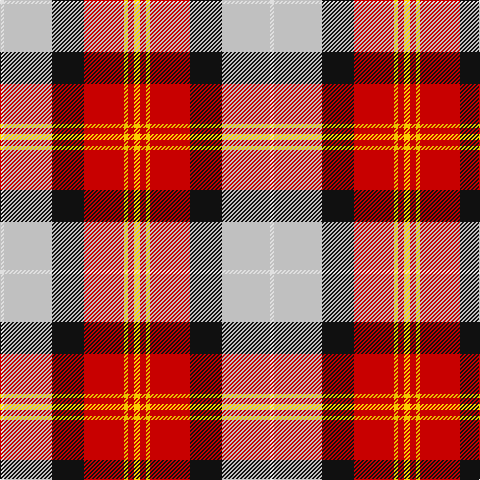

The parent of this is [Oor Wullie (Corporate)](/tartans/ln/4/n48/k32/r40/ya4/r6/y/6/)

This was sourced from tartans-authority.  It is a [7 stripes tartan](/stripes/stripes7/).

Original link http://www.tartansauthority.com/tartan-ferret/display/10356/

## Thread count
LN/4 N48 K32 R40 Ya4 R6 Y/6

## Palette
Each colour and its ΔE from the base-6 reference it is a variant of.

| Colour | Shade | Base | ΔE (OKLab) |
|---|---|---|---|
| K |  `#101010` | K  | 0.17 |
| LN |  `#E0E0E0` | W  | 0.06 |
| N |  `#C0C0C0` | W  | 0.16 |
| R |  `#C80000` | R  | 0.00 |
| Y |  `#FCCC00` | Y  | 0.04 |
| Ya |  `#E8C000` | Y  | 0.00 |

# Sample pattern

ID: /variants/ln/4/n48/k32/r40/ya4/r6/y/6-k101010-lne0e0e0-nc0c0c0-rc80000-yfccc00-yae8c000/
