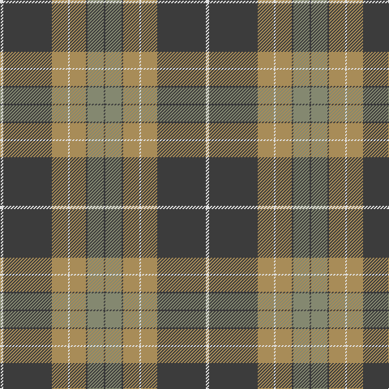

The parent of this is [Evergreen (Fashion)](/tartans/ln/4/n60/lt20/ln2/lt20/n2/na20/n/2/)

This was sourced from tartans-authority.  It is a [8 stripes tartan](/stripes/stripes8/).

Original link http://www.tartansauthority.com/tartan-ferret/display/4830/

## Thread count
LN/4 N60 LT20 LN2 LT20 N2 Na20 N/2

## Palette
Each colour and its ΔE from the base-6 reference it is a variant of.

| Colour | Shade | Base | ΔE (OKLab) |
|---|---|---|---|
| LN |  `#E0E0E0` | W  | 0.06 |
| LT |  `#A88C58` | Y  | 0.19 |
| N |  `#3C3C3C` | B  | 0.12 |
| Na |  `#848870` | G  | 0.22 |

# Sample pattern

ID: /variants/ln/4/n60/lt20/ln2/lt20/n2/na20/n/2-lne0e0e0-lta88c58-n3c3c3c-na848870/
