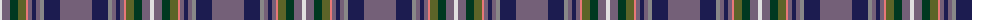

The parent of this is [Scottish H & I Film Com (Corporate)](/tartans/ln/4/n8/dg8/g8/lr2/n4/db4/n4/na4/db16/n/32/)

This was sourced from tartans-authority.  It is a [11 stripes tartan](/stripes/stripes11/).

Original link http://www.tartansauthority.com/tartan-ferret/display/7547/

## Thread count
LN/4 N8 DG8 G8 LR2 N4 DB4 N4 Na4 DB16 N/32

## Palette
Each colour and its ΔE from the base-6 reference it is a variant of.

| Colour | Shade | Base | ΔE (OKLab) |
|---|---|---|---|
| DB |  `#1C1C50` | B  | 0.14 |
| DG |  `#003820` | G  | 0.16 |
| G |  `#5C6428` | G  | 0.09 |
| LN |  `#E0E0E0` | W  | 0.06 |
| LR |  `#E87878` | R  | 0.19 |
| N |  `#746078` | B  | 0.16 |
| Na |  `#888888` | R  | 0.24 |

ID: /variants/ln/4/n8/dg8/g8/lr2/n4/db4/n4/na4/db16/n/32-db1c1c50-dg003820-g5c6428-lne0e0e0-lre87878-n746078-na888888/
