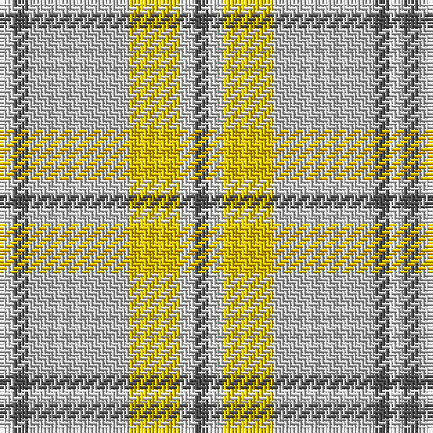

The parent of this is [Cairngorm](/tartans/ln/4/na4/n28/y14/ln4/na/4/)

This was sourced from weddslist.  It is a [6 stripes tartan](/stripes/stripes6/).

Original link http://www.weddslist.com/cgi-bin/tartans/pg.pl?source=sts

## Thread count
LN/4 Na4 N28 Y14 LN4 Na/4

## Palette
Each colour and its ΔE from the base-6 reference it is a variant of.

| Colour | Shade | Base | ΔE (OKLab) |
|---|---|---|---|
| LN |  `#E0E0E0` | W  | 0.06 |
| N |  `#C0C0C0` | W  | 0.16 |
| Na |  `#505050` | B  | 0.12 |
| Y |  `#F0C000` | Y  | 0.01 |

# Sample pattern

ID: /variants/ln/4/na4/n28/y14/ln4/na/4-lne0e0e0-nc0c0c0-na505050-yf0c000/
