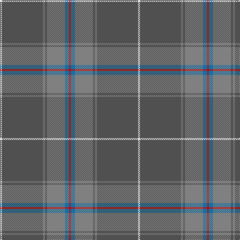

The parent of this is [Haddrell (2013)](/tartans/ln/4/na82/n4/na4/n36/b8/r/4/)

This was sourced from register-of-tartans.  It is a [7 stripes tartan](/stripes/stripes7/).

Original link https://www.tartanregister.gov.uk/tartanDetails.aspx?ref=10938

## Thread count
LN/4 Na82 N4 Na4 N36 B8 R/4

## Palette
Each colour and its ΔE from the base-6 reference it is a variant of.

| Colour | Shade | Base | ΔE (OKLab) |
|---|---|---|---|
| B |  `#1870A4` | B  | 0.14 |
| LN |  `#E0E0E0` | W  | 0.06 |
| N |  `#808080` | G  | 0.22 |
| Na |  `#505050` | B  | 0.12 |
| R |  `#C80000` | R  | 0.00 |

# Sample pattern

ID: /variants/ln/4/na82/n4/na4/n36/b8/r/4-b1870a4-lne0e0e0-n808080-na505050-rc80000/
