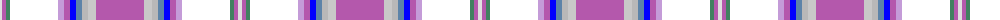

The parent of this is [Kingennie Sunrise](/tartans/ln/4/p4/g4/r48/lp6/p6/ba6/b6/na6/n8/p/48/)

This was sourced from register-of-tartans.  It is a [11 stripes tartan](/stripes/stripes11/).

Original link https://www.tartanregister.gov.uk/tartanDetails.aspx?ref=11467

## Thread count
LN/4 P4 G4 R48 LP6 P6 Ba6 B6 Na6 N8 P/48

## Palette
Each colour and its ΔE from the base-6 reference it is a variant of.

| Colour | Shade | Base | ΔE (OKLab) |
|---|---|---|---|
| B |  `#5C83A8` | B  | 0.21 |
| Ba |  `#0000FF` | B  | 0.21 |
| G |  `#408060` | G  | 0.13 |
| LN |  `#E0E0E0` | W  | 0.06 |
| LP |  `#C49CD8` | W  | 0.24 |
| N |  `#C8C8C8` | W  | 0.13 |
| Na |  `#B8B8B8` | Y  | 0.17 |
| P |  `#B458AC` | R  | 0.20 |

ID: /variants/ln/4/p4/g4/r48/lp6/p6/ba6/b6/na6/n8/p/48-b5c83a8-ba0000ff-g408060-lne0e0e0-lpc49cd8-nc8c8c8-nab8b8b8-pb458ac/
