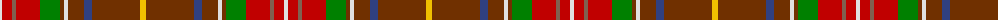

The parent of this is [Unidentified 31](/tartans/ln/4/r10/lt4/r24/g20/t4/ln4/t16/b8/t48/y/6/)

This was sourced from weddslist.  It is a [11 stripes tartan](/stripes/stripes11/).

Original link http://www.weddslist.com/cgi-bin/tartans/pg.pl?source=sts

## Thread count
LN/4 R10 LT4 R24 G20 T4 LN4 T16 B8 T48 Y/6

## Palette
Each colour and its ΔE from the base-6 reference it is a variant of.

| Colour | Shade | Base | ΔE (OKLab) |
|---|---|---|---|
| B |  `#304080` | B  | 0.01 |
| G |  `#008000` | G  | 0.09 |
| LN |  `#E0E0E0` | W  | 0.06 |
| LT |  `#806050` | R  | 0.17 |
| R |  `#C00000` | R  | 0.02 |
| T |  `#703000` | R  | 0.18 |
| Y |  `#F0C000` | Y  | 0.01 |

ID: /variants/ln/4/r10/lt4/r24/g20/t4/ln4/t16/b8/t48/y/6-b304080-g008000-lne0e0e0-lt806050-rc00000-t703000-yf0c000/
