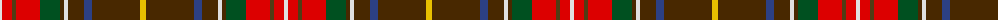

The parent of this is [Unidentified (Possibly Muirhead)](/tartans/ln/4/r10/t4/r24/g20/ta4/ln4/ta16/b8/ta48/y/6/)

This was sourced from register-of-tartans.  It is a [11 stripes tartan](/stripes/stripes11/).

Original link https://www.tartanregister.gov.uk/tartanDetails.aspx?ref=4269

## Thread count
LN/4 R10 T4 R24 G20 Ta4 LN4 Ta16 B8 Ta48 Y/6

## Palette
Each colour and its ΔE from the base-6 reference it is a variant of.

| Colour | Shade | Base | ΔE (OKLab) |
|---|---|---|---|
| B |  `#2C4084` | B  | 0.00 |
| G |  `#005020` | G  | 0.08 |
| LN |  `#E0E0E0` | W  | 0.06 |
| R |  `#DC0000` | R  | 0.04 |
| T |  `#503C14` | G  | 0.15 |
| Ta |  `#482800` | G  | 0.19 |
| Y |  `#E8C000` | Y  | 0.00 |

ID: /variants/ln/4/r10/t4/r24/g20/ta4/ln4/ta16/b8/ta48/y/6-b2c4084-g005020-lne0e0e0-rdc0000-t503c14-ta482800-ye8c000/
