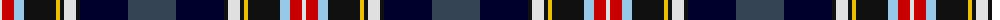

The parent of this is [Scotland's International - Home](/tartans/ln/4/r12/lb10/k32/y4/k4/ln12/k4/dba48/n/48/)

This was sourced from register-of-tartans.  It is a [10 stripes tartan](/stripes/stripes10/).

Original link https://www.tartanregister.gov.uk/tartanDetails.aspx?ref=5794

## Thread count
LN/4 R12 LB10 K32 Y4 K4 LN12 K4 DBa48 N/48

## Palette
Each colour and its ΔE from the base-6 reference it is a variant of.

| Colour | Shade | Base | ΔE (OKLab) |
|---|---|---|---|
| DB |  `#1C1C50` | B  | 0.14 |
| DBa |  `#00002C` | K  | 0.16 |
| K |  `#101010` | K  | 0.17 |
| LB |  `#98C8E8` | W  | 0.17 |
| LN |  `#E0E0E0` | W  | 0.06 |
| N |  `#344454` | B  | 0.09 |
| R |  `#C80000` | R  | 0.00 |
| Y |  `#E8C000` | Y  | 0.00 |

ID: /variants/ln/4/r12/lb10/k32/y4/k4/ln12/k4/dba48/n/48-db1c1c50-dba00002c-k101010-lb98c8e8-lne0e0e0-n344454-rc80000-ye8c000/
