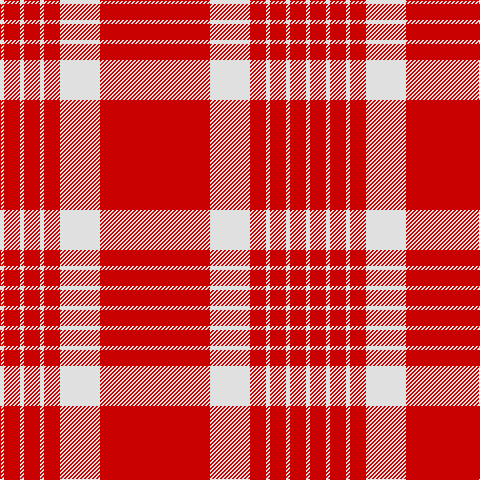

The parent of this is [Masai Shuka 08 (Artefact)](/tartans/ln/4/r16/ln4/r16/ln4/r16/ln40/r/110/)

This was sourced from tartans-authority.  It is a [8 stripes tartan](/stripes/stripes8/).

Original link http://www.tartansauthority.com/tartan-ferret/display/7199/

## Thread count
LN/4 R16 LN4 R16 LN4 R16 LN40 R/110

## Palette
Each colour and its ΔE from the base-6 reference it is a variant of.

| Colour | Shade | Base | ΔE (OKLab) |
|---|---|---|---|
| LN |  `#E0E0E0` | W  | 0.06 |
| R |  `#C80000` | R  | 0.00 |

# Sample pattern

ID: /variants/ln/4/r16/ln4/r16/ln4/r16/ln40/r/110-lne0e0e0-rc80000/
