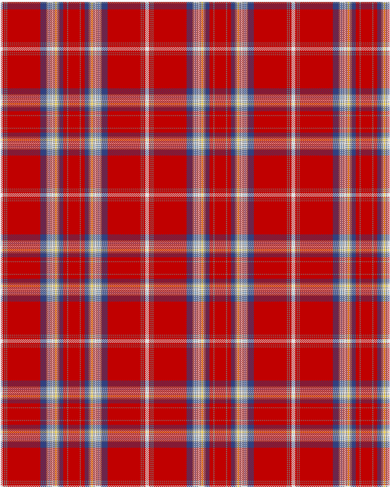

Glasgow, '88

This was sourced from <no value>.  It is a 22 stripes tartan.

Original link http://www.weddslist.com/cgi-bin/tartans/pg.pl?source=sts

## Thread count
LN/4 R3 N2 R2 N2 R68 B12 N3 LN2 BA2 LN2 N2 LN4 N2 LN2 Y2 LN2 N4 B8 R8 N2 R/12

## Palette
B#304080 BA#5480B0 LN#E0E0E0 N#808080 R#C00000 Y#F0C000

# Sample pattern

ID: /variants/ln/4/r3/n2/r2/n2/r68/b12/n3/ln2/ba2/ln2/n2/ln4/n2/ln2/y2/ln2/n4/b8/r8/n2/r/12-b304080-ba5480b0-lne0e0e0-n808080-rc00000-yf0c000