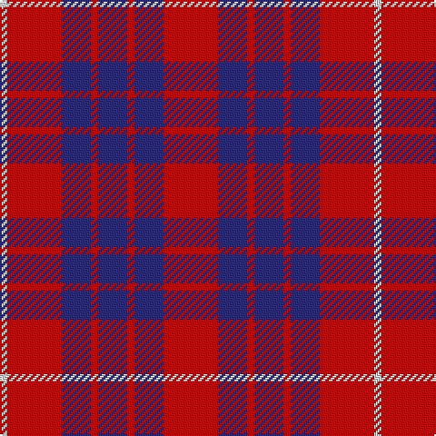

The parent of this is [Hamilton](/tartans/ln/4/r30/dba16/r4/dba16/r4/dba16/r/30/)

This was sourced from register-of-tartans.  It is a [8 stripes tartan](/stripes/stripes8/).

Original link https://www.tartanregister.gov.uk/tartanDetails.aspx?ref=1576

## Thread count
LN/4 R30 DBa16 R4 DBa16 R4 DBa16 R/30

## Palette
Each colour and its ΔE from the base-6 reference it is a variant of.

| Colour | Shade | Base | ΔE (OKLab) |
|---|---|---|---|
| B |  `#1474B4` | B  | 0.15 |
| DB |  `#1C0070` | B  | 0.14 |
| DBa |  `#2C2C80` | B  | 0.05 |
| DR |  `#880000` | R  | 0.14 |
| LN |  `#E0E0E0` | W  | 0.06 |
| R |  `#C80000` | R  | 0.00 |
| W |  `#FCFCFC` | W  | 0.03 |

# Sample pattern

ID: /variants/ln/4/r30/dba16/r4/dba16/r4/dba16/r/30-b1474b4-db1c0070-dba2c2c80-dr880000-lne0e0e0-rc80000-wfcfcfc/
