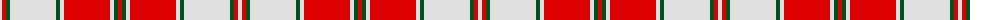

The parent of this is [Hose](/tartans/ln/4/r4/g4/ln46/g4/ln4/r46/ln4/g4/r/4/)

This was sourced from register-of-tartans.  It is a [10 stripes tartan](/stripes/stripes10/).

Original link https://www.tartanregister.gov.uk/tartanDetails.aspx?ref=1767

## Thread count
LN/4 R4 G4 LN46 G4 LN4 R46 LN4 G4 R/4

## Palette
Each colour and its ΔE from the base-6 reference it is a variant of.

| Colour | Shade | Base | ΔE (OKLab) |
|---|---|---|---|
| G |  `#005020` | G  | 0.08 |
| LN |  `#E0E0E0` | W  | 0.06 |
| R |  `#DC0000` | R  | 0.04 |

ID: /variants/ln/4/r4/g4/ln46/g4/ln4/r46/ln4/g4/r/4-g005020-lne0e0e0-rdc0000/
