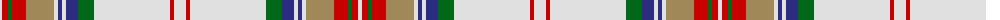

The parent of this is [Grant of Acharrow Artifact Tartan Tartan Number: 1844. Earliest known date: pre 2003 This tartan can be seen in the form of an Arisaid at Kingussie museum. See products available Copyright © Blair Urquhart, Comrie, 2015](/tartans/ln/4/r6/g4/r14/lt28/ln4/db4/ln4/db12/g16/ln76/r4/ln/12/)

This was sourced from house-of-tartan.  It is a [13 stripes tartan](/stripes/stripes13/).

Original link http://www.house-of-tartan.scotland.net/house/TartanViewjs.asp?colr=Def&tnam=1844

## Thread count
LN/4 R6 G4 R14 LT28 LN4 DB4 LN4 DB12 G16 LN76 R4 LN/12

## Palette
Each colour and its ΔE from the base-6 reference it is a variant of.

| Colour | Shade | Base | ΔE (OKLab) |
|---|---|---|---|
| DB |  `#2C2C80` | B  | 0.05 |
| G |  `#006818` | G  | 0.02 |
| LN |  `#E0E0E0` | W  | 0.06 |
| LT |  `#A08858` | Y  | 0.21 |
| R |  `#C80000` | R  | 0.00 |

ID: /variants/ln/4/r6/g4/r14/lt28/ln4/db4/ln4/db12/g16/ln76/r4/ln/12-db2c2c80-g006818-lne0e0e0-lta08858-rc80000/
