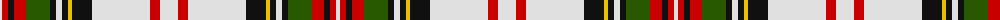

The parent of this is [Hay or Stewart](/tartans/ln/4/r6/k6/r12/g24/k6/ln6/k6/y4/k20/ln58/r10/ln/18/)

This was sourced from register-of-tartans.  It is a [13 stripes tartan](/stripes/stripes13/).

Original link https://www.tartanregister.gov.uk/tartanDetails.aspx?ref=1634

## Thread count
LN/4 R6 K6 R12 G24 K6 LN6 K6 Y4 K20 LN58 R10 LN/18

## Palette
Each colour and its ΔE from the base-6 reference it is a variant of.

| Colour | Shade | Base | ΔE (OKLab) |
|---|---|---|---|
| G |  `#285800` | G  | 0.04 |
| K |  `#101010` | K  | 0.17 |
| LN |  `#E0E0E0` | W  | 0.06 |
| R |  `#C80000` | R  | 0.00 |
| Y |  `#E8C000` | Y  | 0.00 |

ID: /variants/ln/4/r6/k6/r12/g24/k6/ln6/k6/y4/k20/ln58/r10/ln/18-g285800-k101010-lne0e0e0-rc80000-ye8c000/
