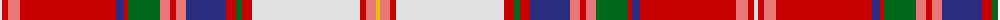

The parent of this is [Somerville Dress (Name?)](/tartans/ln/4/r6/lr12/r96/db8/r4/g32/lr10/r6/lr10/db40/r10/g6/r10/ln108/r6/lr10/y/4/)

This was sourced from tartans-authority.  It is a [18 stripes tartan](/stripes/stripes18/).

Original link http://www.tartansauthority.com/tartan-ferret/display/8847/

## Thread count
LN/4 R6 LR12 R96 DB8 R4 G32 LR10 R6 LR10 DB40 R10 G6 R10 LN108 R6 LR10 Y/4

## Palette
Each colour and its ΔE from the base-6 reference it is a variant of.

| Colour | Shade | Base | ΔE (OKLab) |
|---|---|---|---|
| DB |  `#2C2C80` | B  | 0.05 |
| G |  `#006818` | G  | 0.02 |
| LN |  `#E0E0E0` | W  | 0.06 |
| LR |  `#E87878` | R  | 0.19 |
| R |  `#C80000` | R  | 0.00 |
| Y |  `#E8C000` | Y  | 0.00 |

ID: /variants/ln/4/r6/lr12/r96/db8/r4/g32/lr10/r6/lr10/db40/r10/g6/r10/ln108/r6/lr10/y/4-db2c2c80-g006818-lne0e0e0-lre87878-rc80000-ye8c000/
