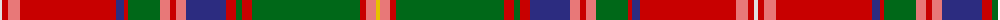

The parent of this is [Sommerville](/tartans/ln/4/r6/lr12/r96/dba8/r4/ga32/lr10/r6/lr10/dba40/r10/ga6/r10/ga108/r6/lr10/y/4/)

This was sourced from register-of-tartans.  It is a [18 stripes tartan](/stripes/stripes18/).

Original link https://www.tartanregister.gov.uk/tartanDetails.aspx?ref=3835

## Thread count
LN/4 R6 LR12 R96 DBa8 R4 Ga32 LR10 R6 LR10 DBa40 R10 Ga6 R10 Ga108 R6 LR10 Y/4

## Palette
Each colour and its ΔE from the base-6 reference it is a variant of.

| Colour | Shade | Base | ΔE (OKLab) |
|---|---|---|---|
| DB |  `#003C64` | B  | 0.07 |
| DBa |  `#2C2C80` | B  | 0.05 |
| DR |  `#4C0000` | B  | 0.24 |
| DRa |  `#A00000` | R  | 0.09 |
| DY |  `#D09800` | Y  | 0.11 |
| G |  `#285800` | G  | 0.04 |
| Ga |  `#006818` | G  | 0.02 |
| LN |  `#E0E0E0` | W  | 0.06 |
| LR |  `#E87878` | R  | 0.19 |
| N |  `#C0C0C0` | W  | 0.16 |
| R |  `#C80000` | R  | 0.00 |
| Y |  `#E8C000` | Y  | 0.00 |

ID: /variants/ln/4/r6/lr12/r96/dba8/r4/ga32/lr10/r6/lr10/dba40/r10/ga6/r10/ga108/r6/lr10/y/4-db003c64-dba2c2c80-dr4c0000-draa00000-dyd09800-g285800-ga006818-lne0e0e0-lre87878-nc0c0c0-rc80000-ye8c000/
