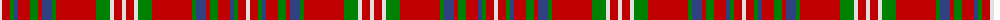

The parent of this is [MacKinnon 9](/tartans/ln/4/r8/g4/b4/r12/g8/r4/b10/g4/r40/g14/ln4/r8/ln/4/)

This was sourced from weddslist.  It is a [14 stripes tartan](/stripes/stripes14/).

Original link http://www.weddslist.com/cgi-bin/tartans/pg.pl?source=sts

## Thread count
LN/4 R8 G4 B4 R12 G8 R4 B10 G4 R40 G14 LN4 R8 LN/4

## Palette
Each colour and its ΔE from the base-6 reference it is a variant of.

| Colour | Shade | Base | ΔE (OKLab) |
|---|---|---|---|
| B |  `#304080` | B  | 0.01 |
| G |  `#008000` | G  | 0.09 |
| LN |  `#E0E0E0` | W  | 0.06 |
| R |  `#C00000` | R  | 0.02 |

ID: /variants/ln/4/r8/g4/b4/r12/g8/r4/b10/g4/r40/g14/ln4/r8/ln/4-b304080-g008000-lne0e0e0-rc00000/
