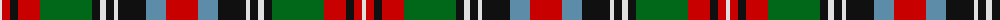

The parent of this is [Stuart Pr Charles Edward Artifact Tartan Tartan Number: 1374. Earliest known date: 1746 'Trews worn by Prince Charles Edward' See products available Copyright © Blair Urquhart, Comrie, 2015](/tartans/ln/4/r8/k8/r22/g52/k8/ln6/k8/ln4/k28/b20/r/32/)

This was sourced from house-of-tartan.  It is a [12 stripes tartan](/stripes/stripes12/).

Original link http://www.house-of-tartan.scotland.net/house/TartanViewjs.asp?colr=Def&tnam=1374

## Thread count
LN/4 R8 K8 R22 G52 K8 LN6 K8 LN4 K28 B20 R/32

## Palette
Each colour and its ΔE from the base-6 reference it is a variant of.

| Colour | Shade | Base | ΔE (OKLab) |
|---|---|---|---|
| B |  `#5C8CA8` | B  | 0.23 |
| G |  `#006818` | G  | 0.02 |
| K |  `#101010` | K  | 0.17 |
| LN |  `#E0E0E0` | W  | 0.06 |
| R |  `#C80000` | R  | 0.00 |

ID: /variants/ln/4/r8/k8/r22/g52/k8/ln6/k8/ln4/k28/b20/r/32-b5c8ca8-g006818-k101010-lne0e0e0-rc80000/
