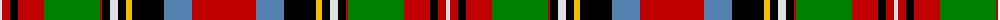

The parent of this is [Carolina](/tartans/ln/4/r8/k8/r26/g56/r2/k8/ln8/k8/y6/k32/b28/r/64/)

This was sourced from weddslist.  It is a [13 stripes tartan](/stripes/stripes13/).

Original link http://www.weddslist.com/cgi-bin/tartans/pg.pl?source=sts

## Thread count
LN/4 R8 K8 R26 G56 R2 K8 LN8 K8 Y6 K32 B28 R/64

## Palette
Each colour and its ΔE from the base-6 reference it is a variant of.

| Colour | Shade | Base | ΔE (OKLab) |
|---|---|---|---|
| B |  `#5480B0` | B  | 0.20 |
| G |  `#008000` | G  | 0.09 |
| K |  `#000000` | K  | 0.00 |
| LN |  `#E0E0E0` | W  | 0.06 |
| R |  `#C00000` | R  | 0.02 |
| Y |  `#F0C000` | Y  | 0.01 |

ID: /variants/ln/4/r8/k8/r26/g56/r2/k8/ln8/k8/y6/k32/b28/r/64-b5480b0-g008000-k000000-lne0e0e0-rc00000-yf0c000/
