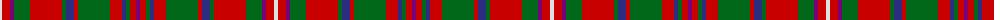

The parent of this is [MacKinnon Clan Tartan Tartan Number: 540. Earliest known date: 1816 The MacKinnon tartan now generally available and approved by the chief, has altered its appearance over the years, and returned to the form of the earliest example. The collection of certified tartans made by the Highland Society of London (c.1816) includes a specimen signed by the Mackinnon in which the purple stripes are a light shade of azure, a minor change that is mirrored in other tartans, notably the Royal Stewart. Logan (1831) recorded these stripes in white, Smibert (1850) in pink, Smith (1850) in crimson, McIan (1847) in black and white and Grant (1886) as black. MacKinnons are associated with the Isle of Iona as early church leaders, and the name has been anglicized to 'Love'. See products available Copyright © Blair Urquhart, Comrie, 2015](/tartans/ln/4/r8/p4/g16/r32/g4/db8/r4/g32/r12/db4/g4/r6/p/4/)

This was sourced from house-of-tartan.  It is a [14 stripes tartan](/stripes/stripes14/).

Original link http://www.house-of-tartan.scotland.net/house/TartanViewjs.asp?colr=Def&tnam=540

## Thread count
LN/4 R8 P4 G16 R32 G4 DB8 R4 G32 R12 DB4 G4 R6 P/4

## Palette
Each colour and its ΔE from the base-6 reference it is a variant of.

| Colour | Shade | Base | ΔE (OKLab) |
|---|---|---|---|
| DB |  `#2C2C80` | B  | 0.05 |
| G |  `#006818` | G  | 0.02 |
| LN |  `#E0E0E0` | W  | 0.06 |
| P |  `#780078` | B  | 0.16 |
| R |  `#C80000` | R  | 0.00 |

ID: /variants/ln/4/r8/p4/g16/r32/g4/db8/r4/g32/r12/db4/g4/r6/p/4-db2c2c80-g006818-lne0e0e0-p780078-rc80000/
