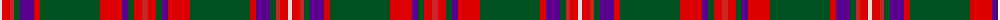

The parent of this is [MacKinnon #7](/tartans/ln/4/ra8/r4/g6/p14/ra6/g60/ra22/p6/g6/ra8/r/6/)

This was sourced from register-of-tartans.  It is a [12 stripes tartan](/stripes/stripes12/).

Original link https://www.tartanregister.gov.uk/tartanDetails.aspx?ref=2551

## Thread count
LN/4 Ra8 R4 G6 P14 Ra6 G60 Ra22 P6 G6 Ra8 R/6

## Palette
Each colour and its ΔE from the base-6 reference it is a variant of.

| Colour | Shade | Base | ΔE (OKLab) |
|---|---|---|---|
| G |  `#005020` | G  | 0.08 |
| LN |  `#E0E0E0` | W  | 0.06 |
| P |  `#5A008C` | B  | 0.12 |
| R |  `#C82828` | R  | 0.03 |
| Ra |  `#DC0000` | R  | 0.04 |

ID: /variants/ln/4/ra8/r4/g6/p14/ra6/g60/ra22/p6/g6/ra8/r/6-g005020-lne0e0e0-p5a008c-rc82828-radc0000/
