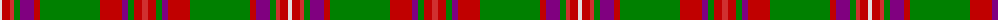

The parent of this is [MacKinnon 1](/tartans/ln/4/ra8/r4/g6/p14/ra6/g60/ra22/p6/g6/ra8/r/6/)

This was sourced from weddslist.  It is a [12 stripes tartan](/stripes/stripes12/).

Original link http://www.weddslist.com/cgi-bin/tartans/pg.pl?source=sts

## Thread count
LN/4 Ra8 R4 G6 P14 Ra6 G60 Ra22 P6 G6 Ra8 R/6

## Palette
Each colour and its ΔE from the base-6 reference it is a variant of.

| Colour | Shade | Base | ΔE (OKLab) |
|---|---|---|---|
| G |  `#008000` | G  | 0.09 |
| LN |  `#E0E0E0` | W  | 0.06 |
| P |  `#800080` | B  | 0.17 |
| R |  `#D03030` | R  | 0.05 |
| Ra |  `#C00000` | R  | 0.02 |

ID: /variants/ln/4/ra8/r4/g6/p14/ra6/g60/ra22/p6/g6/ra8/r/6-g008000-lne0e0e0-p800080-rd03030-rac00000/
