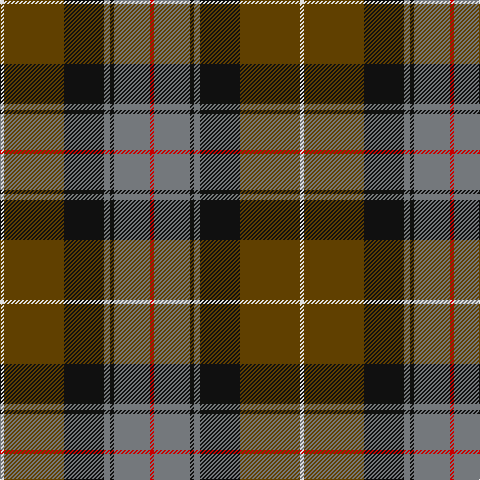

The parent of this is [Bennett, J P. (Personal)](/tartans/ln/4/t60/k40/n6/k4/n36/r/4/)

This was sourced from tartans-authority.  It is a [7 stripes tartan](/stripes/stripes7/).

Original link http://www.tartansauthority.com/tartan-ferret/display/10222/

## Thread count
LN/4 T60 K40 N6 K4 N36 R/4

## Palette
Each colour and its ΔE from the base-6 reference it is a variant of.

| Colour | Shade | Base | ΔE (OKLab) |
|---|---|---|---|
| K |  `#101010` | K  | 0.17 |
| LN |  `#E0E0E0` | W  | 0.06 |
| N |  `#74787C` | G  | 0.20 |
| R |  `#C80000` | R  | 0.00 |
| T |  `#604000` | G  | 0.14 |

# Sample pattern

ID: /variants/ln/4/t60/k40/n6/k4/n36/r/4-k101010-lne0e0e0-n74787c-rc80000-t604000/
