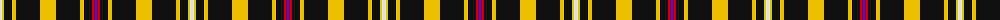

The parent of this is [Gary Personal Tartan Tartan Number: 564. Earliest known date: 1985 Restricted See products available Copyright © Blair Urquhart, Comrie, 2015](/tartans/ln/4/y2/k8/y4/k24/y16/k24/y4/k8/r2/p/4/)

This was sourced from house-of-tartan.  It is a [11 stripes tartan](/stripes/stripes11/).

Original link http://www.house-of-tartan.scotland.net/house/TartanViewjs.asp?colr=Def&tnam=564

## Thread count
LN/4 Y2 K8 Y4 K24 Y16 K24 Y4 K8 R2 P/4

## Palette
Each colour and its ΔE from the base-6 reference it is a variant of.

| Colour | Shade | Base | ΔE (OKLab) |
|---|---|---|---|
| K |  `#101010` | K  | 0.17 |
| LN |  `#E0E0E0` | W  | 0.06 |
| P |  `#780078` | B  | 0.16 |
| R |  `#C80000` | R  | 0.00 |
| Y |  `#E8C000` | Y  | 0.00 |

ID: /variants/ln/4/y2/k8/y4/k24/y16/k24/y4/k8/r2/p/4-k101010-lne0e0e0-p780078-rc80000-ye8c000/
