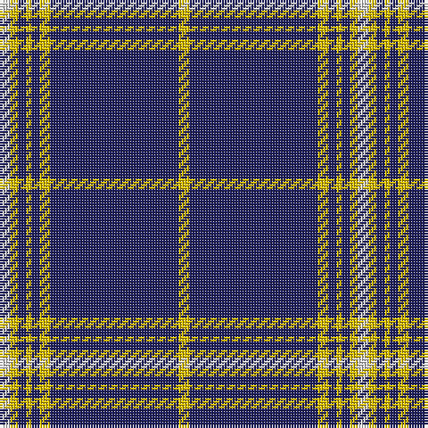

The parent of this is [Morris of Wales](/tartans/ln/4/y3/db3/y2/db3/y4/db48/y/4/)

This was sourced from register-of-tartans.  It is a [8 stripes tartan](/stripes/stripes8/).

Original link https://www.tartanregister.gov.uk/tartanDetails.aspx?ref=3018

## Thread count
LN/4 Y3 DB3 Y2 DB3 Y4 DB48 Y/4

## Palette
Each colour and its ΔE from the base-6 reference it is a variant of.

| Colour | Shade | Base | ΔE (OKLab) |
|---|---|---|---|
| DB |  `#202060` | B  | 0.11 |
| LN |  `#E0E0E0` | W  | 0.06 |
| Y |  `#E8C000` | Y  | 0.00 |

# Sample pattern

ID: /variants/ln/4/y3/db3/y2/db3/y4/db48/y/4-db202060-lne0e0e0-ye8c000/
