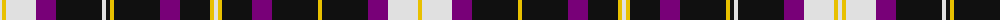

The parent of this is [Freger (Corporate)](/tartans/ln/4/y4/ln30/p20/k46/ln4/k4/y4/k46/p20/k30/y4/ln4/y4/k30/p20/k46/y4/k46/p20/ln30/y/4/)

This was sourced from tartans-authority.  It is a [22 stripes tartan](/stripes/stripes22/).

Original link http://www.tartansauthority.com/tartan-ferret/display/7531/

## Thread count
LN/4 Y4 LN30 P20 K46 LN4 K4 Y4 K46 P20 K30 Y4 LN4 Y4 K30 P20 K46 Y4 K46 P20 LN30 Y/4

## Palette
Each colour and its ΔE from the base-6 reference it is a variant of.

| Colour | Shade | Base | ΔE (OKLab) |
|---|---|---|---|
| K |  `#101010` | K  | 0.17 |
| LN |  `#E0E0E0` | W  | 0.06 |
| P |  `#780078` | B  | 0.16 |
| Y |  `#E8C000` | Y  | 0.00 |

ID: /variants/ln/4/y4/ln30/p20/k46/ln4/k4/y4/k46/p20/k30/y4/ln4/y4/k30/p20/k46/y4/k46/p20/ln30/y/4-k101010-lne0e0e0-p780078-ye8c000/
